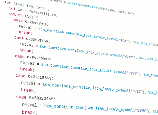

# Installation

## Using binary package


There are AMD64 binaries for
 Jessie (8),
 Sid (9),
 Trusty (14.04), and
 Xenial (16.04)

To install the software, you have to add the AIscm repository to your list of repositories and install via apt-get. To do this, paste the following lines into your terminal:

```
echo "deb https://wedesoft.github.io/aiscm/apt `lsb_release -cs` main" | sudo tee /etc/apt/sources.list.d/aiscm.list
wget -qO- https://wedesoft.github.io/aiscm/apt/pubkey.gpg | sudo apt-key add -
sudo apt-get update
sudo apt-get install aiscm
```

If you wish, you can additionally register the sources with *apt*:

```
echo "deb-src https://wedesoft.github.io/aiscm/apt `lsb_release -cs` main" | sudo tee -a /etc/apt/sources.list.d/aiscm.list
```

## Compile from source



### Get the source code

You can download the latest release like this

```
wget `curl -s https://api.github.com/repos/wedesoft/aiscm/releases/latest | grep download_url | cut -d '"' -f 4`
```

### Install dependencies

You need to install the dependencies:

```
sudo apt-get install -q --yes build-essential autoconf automake libtool
sudo apt-get install guile-2.0-dev linux-libc-dev gettext libmjpegtools-dev imagemagick libmagickcore-dev libpulse-dev libjpeg-dev libx11-dev libxext-dev libxv-dev libxmu-dev libxi-dev libglu1-mesa-dev libgl1-mesa-dev libswscale-dev libavformat-dev libavcodec-dev libavutil-dev pandoc
```

### Build AIscm

```
tar xJf aiscm-*.tar.xz
cd aiscm-*
./configure
make -j
sudo make install
```
